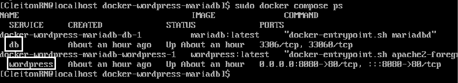
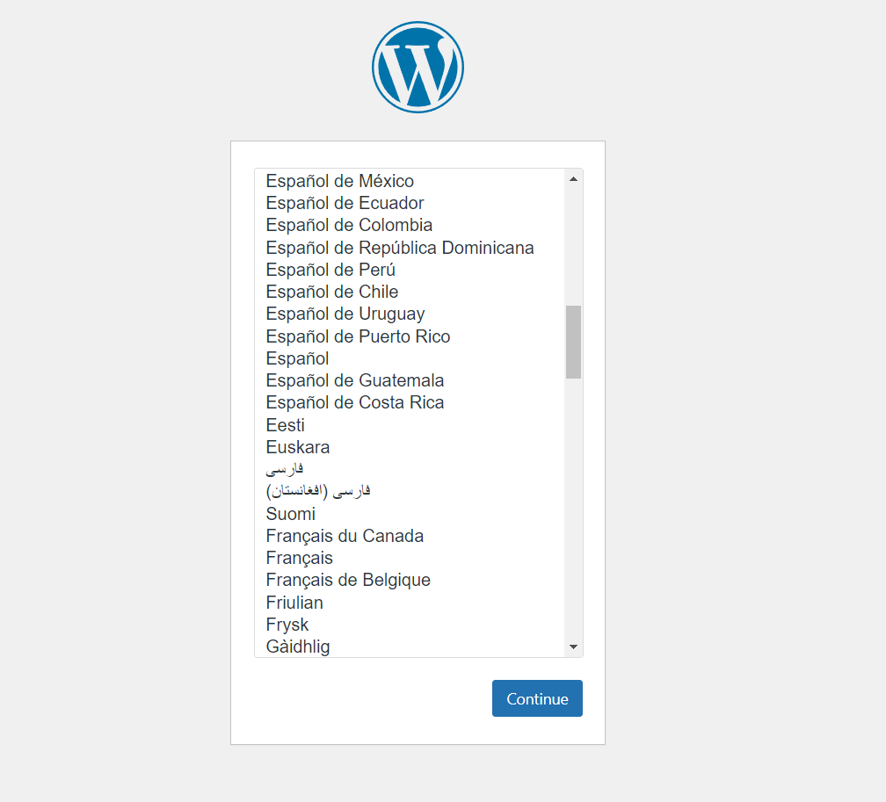
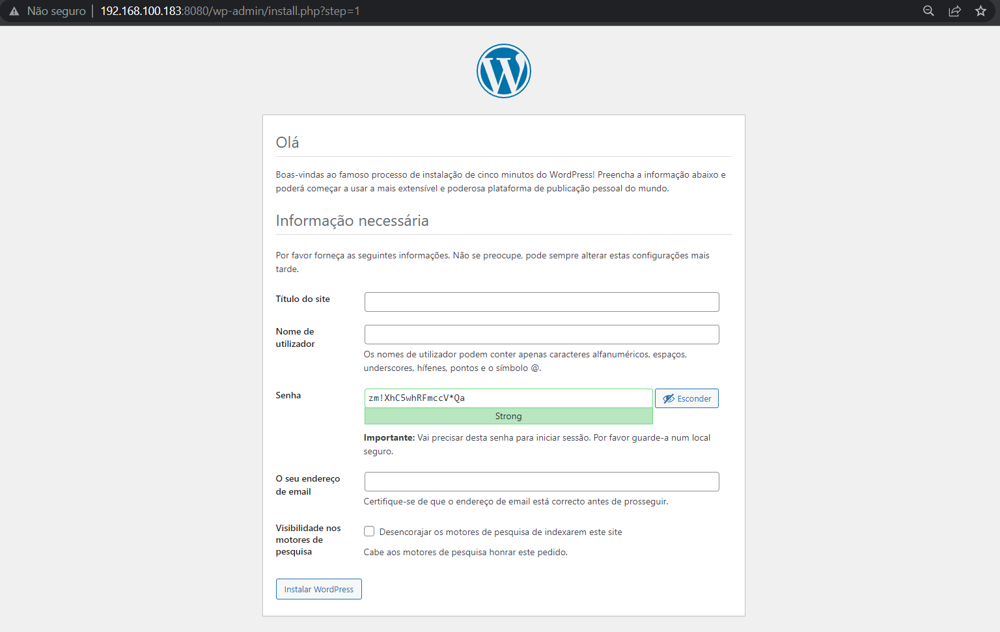

<p align="center">
  <a href="" rel="noopener">
 </a>
</p>

<h1 align="center">Criando uma imagem do Wordpress com banco de dados e docker-compose</h1> 
<p align="center"><i>Criando uma imagem do Wordpress utilizando banco de dados PostgreSQL e persistindo os dados do DB usando docker-compose.</i></p>

## Desafios anteriores:
- [Desafio 1 - Instalando Docker em uma VM Oracle Linux](https://github.com/CleitonOS/compass-docker-desafio1)
- [Desafio 2 - Criando uma imagem do PostgreSQL no Docker](https://github.com/CleitonOS/compass-docker-desafio2)

## 📝 Tabela de conteúdos
- [Instalando tudo que é necessário (Passo 1)](#step1)
- [Criando uma imagem do PostgreSQL com o Docker Compose via CLI (Passo 2)](#step2)
- [Iniciando o serviço do PostgreSQL com o Docker compose (Passo 3)](#step3)
- [Referências](#documentation)

## 🖥️ Instalando tudo que é necessário (Passo 1)<a name = "step1"></a>

- Nesse desafio será preciso ter instalado o **Docker** e o **Docker-compose** (Para mais informações, acesse o desafio 1 no link abaixo com instruções para instalação).

- Para instalar os outros utilitários necessários acompanhe essa mesma seção no [Desafio 1](https://github.com/CleitonOS/compass-docker-desafio1) com todas as informações.


## 🛠️ Criando uma imagem do Wordpress e MariaDB com Docker-compose (Passo 2)<a name = "step2"></a>

1. Crie um diretório de projeto vazio.
    
- Este diretório deve conter apenas recursos para construir essa imagem.

- Exemplo:
    ```
    $ mkdir docker-wordpress-mariadb
    ```

2. Criando um arquivo de configuração `docker-compose.yml`.

- Vá para o diretório que você criou.
    
    ```
    $ cd docker-wordpress-mariadb
    ```

- Crie o arquivo docker-compose:

    ```
    $ touch docker-compose.yml | nano
    ```

    - Esse arquivo inicia seu Wordpress e uma instância do MySQL separada com montagens de volumes para persistência dos dados.

- Dentro do arquivo YAML, estruture da seguinte forma:

    ```yaml
    services:
        db:
            image: mariadb:latest
            command: '--default-authentication-plugin=mysql_native_password'
            volumes:
                - db_data:/var/lib/mysql
            restart: always
            environment:
                - MYSQL_ROOT_PASSWORD=somewordpress
                - MYSQL_DATABASE=wordpress
                - MYSQL_USER=wordpress
                - MYSQL_PASSWORD=wordpress
            expose:
                - 3306
                - 33060
        wordpress:
            image: wordpress:latest
            volumes:
                - wp_data:/var/www/html
            ports:
                - 8080:80
            restart: always
            environment:
                - WORDPRESS_DB_HOST=db
                - WORDPRESS_DB_USER=wordpress
                - WORDPRESS_DB_PASSWORD=wordpress
                - WORDPRESS_DB_NAME=wordpress
    volumes:
        db_data:
        wp_data:
    ```

    - Observação: Caso a porta '80' esteja em uso, utilize '8080', como no meu caso.

    - Saia do arquivo com 'CTRL + X'

    - Lembre-se de indentar o código YAML corretamente (**Com dois espaços de diferença**).

3. Verifique se os contêineres estão execução:

    ```
    $ sudo docker compose ps
    ```

- Esses são os serviços em execução:

    

## ▶️ Construa as imagens (Passo 3)<a name = "step3"></a>

1. Execute o seguinte comando, para criar os contêineres do WordPress e do PostgreSQL e iniciá-los em segundo plano:

    ```
    $ docker compose up -d
    ```

    - Executa o comando a partir do diretório do projeto.

## ⚙️ Configure o Wordpress (Passo 4)<a name = "step3"></a>

1. A partir deste ponto, o WordPress estará disponível em "http://localhost" (para porta 80), ou em "http://localhost:8080". Caso sua máquina tenha um IP Fixo, acesse pelo IP da máquina.

    

2. Logo depois insira as informações necessárias e instale o Wordpress.

    

- Observação:
    - Para remover os contêineres e a rede padrão (mas preservar o banco de dados) utilize esse comando:

    ```
    $ docker compose down
    ```

    - Para remover os contêineres, rede padrão e também o banco de dados (persistido/volume) utilize esse comando:

    ```
    $ docker compose down --volumes
    ```


### Desafio finalizado

## Referências utilizadas:<a name="documentation"></a>
- [Documentação Docker Compose, Getting Started.](https://docs.docker.com/compose/gettingstarted/)

- [Guia de início rápido: Compose e WordPress](https://github.com/docker/awesome-compose/tree/master/official-documentation-samples/wordpress/)